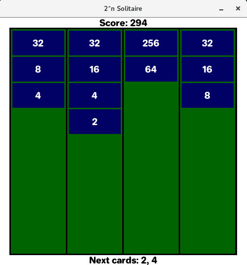

<pre>
  ___  _ __     _____       _ _ _        _
 |__ \| '_ \   / ____|     | (_) |      (_)
    ) |_| |_| | (___   ___ | |_| |_ __ _ _ _ __ ___
   / /         \___ \ / _ \| | | __/ _` | | '__/ _ \
  / /_         ____) | (_) | | | || (_| | | | |  __/
 |____|       |_____/ \___/|_|_|\__\__,_|_|_|  \___|

</pre>

2n Solitaire is a simple game inspired by 2048 Solitaire (but more
generic) which is inspired by 2048 (but instead of tiles in a grid you collect
cards here). I find the game fun and satisfying and thus I decided to try and
implement it using Pygame. Here we are.

The goal of the game is to stack an endless row of cards into limited-size
columns. Each time you stack two cards of the same value one on the other,
the two cards are replaced by one of double the value and your score grows.
The game ends once all the columns are full and so no more cards can be played.

### Controls

This is how the game looks like. At the top you can see your current score,
below that is the main board where the cards are stacked. In the bottom part you
can see two next cards that will come to the game. You can use `1`, `2`, `3` and
`4` keys to place the next upcoming card to the respective column. That's it.
Simple, eh?

### Current state

The game works but doesn't do anything fancy yet. In fact it doesn't even end
unless you quit and once you fill all columns with cards you can just watch
the game board until you get bored and quit the game yourself. On the other hand
it won't yell at you that the game is over which can be considered a plus?
I guess?

### Future plans

-   Game over (Oh yeah, the game will yell at you at some point)
-   Cards with a value high enough will disappear
-   High score recording
-   Special cards?
-   Limited swapping *next cards*?
-   Limited discarding *next cards*?
-   Saving game state on exit?
-   Better *graphics*?
-   Mouse support?

See/add issues if interested in anything particular.
